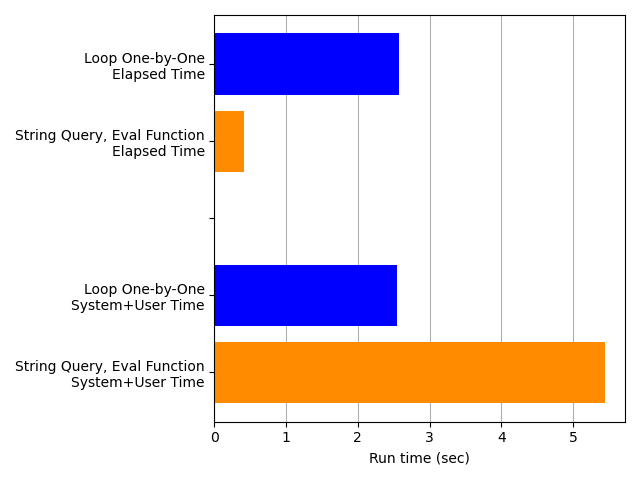
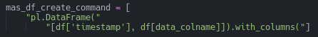

# How to add columns to Polars dataframes fast

## The Conundrum

I was recently writing a function to add columns of moving averages to a 
    [Polars](https://www.pola.rs/) dataframe.  For a particular problem, this is 
    a simple thing to do.  For example, we might have a dataframe like this 
    ([line 17 for a similar 
    example](https://github.com/afairless/polars_add_columns_dynamically_fast/blob/main/tests/test_moving_averages.py)):


```python
import warnings
import datetime
import polars as pl
warnings.filterwarnings('ignore')
```


```python
df = pl.DataFrame({
    'timestamp': [
        datetime.datetime(2022, 2, 1, 10, 0, 0),
        datetime.datetime(2022, 2, 1, 10, 0, 1),
        datetime.datetime(2022, 2, 1, 10, 0, 2),
        datetime.datetime(2022, 2, 1, 10, 0, 3),
        datetime.datetime(2022, 3, 1, 10, 0, 4)],
    'data': [1, 2, 3, 4, 5]})
```


```python
df
```


<div><style>
.dataframe > thead > tr > th,
.dataframe > tbody > tr > td {
  text-align: right;
  white-space: pre-wrap;
}
</style>
<small>shape: (5, 2)</small><table border="1" class="dataframe"><thead><tr><th>timestamp</th><th>data</th></tr><tr><td>datetime[μs]</td><td>i64</td></tr></thead><tbody><tr><td>2022-02-01 10:00:00</td><td>1</td></tr><tr><td>2022-02-01 10:00:01</td><td>2</td></tr><tr><td>2022-02-01 10:00:02</td><td>3</td></tr><tr><td>2022-02-01 10:00:03</td><td>4</td></tr><tr><td>2022-03-01 10:00:04</td><td>5</td></tr></tbody></table></div>


Suppose we want to add three columns of [moving averages, one with a window 
    size](https://en.wikipedia.org/wiki/Moving_average) of 2, the second window
    of size 3, and the final one of size 4.  That's a straightforward command
    in Polars ([line 
    85](https://github.com/afairless/polars_add_columns_dynamically_fast/blob/main/src/s01_timing/moving_averages.py)):


```python
def calculate_moving_averages_hard_coded(
    df: pl.DataFrame, data_colname: str='data') -> pl.DataFrame:
    """
    Calculates moving averages of 'data_colname' column in dataframe 'df' with
        3 window sizes, so that each window size corresponds to a single column 
        of moving averages
    """

    mas_df = df.with_columns(
        ma_2=pl.col(data_colname).rolling_mean(window_size=2),
        ma_3=pl.col(data_colname).rolling_mean(window_size=3),
        ma_4=pl.col(data_colname).rolling_mean(window_size=4))

    return mas_df
```


```python
result = calculate_moving_averages_hard_coded(df) 
result
```


<div><style>
.dataframe > thead > tr > th,
.dataframe > tbody > tr > td {
  text-align: right;
  white-space: pre-wrap;
}
</style>
<small>shape: (5, 5)</small><table border="1" class="dataframe"><thead><tr><th>timestamp</th><th>data</th><th>ma_2</th><th>ma_3</th><th>ma_4</th></tr><tr><td>datetime[μs]</td><td>i64</td><td>f64</td><td>f64</td><td>f64</td></tr></thead><tbody><tr><td>2022-02-01 10:00:00</td><td>1</td><td>null</td><td>null</td><td>null</td></tr><tr><td>2022-02-01 10:00:01</td><td>2</td><td>1.5</td><td>null</td><td>null</td></tr><tr><td>2022-02-01 10:00:02</td><td>3</td><td>2.5</td><td>2.0</td><td>null</td></tr><tr><td>2022-02-01 10:00:03</td><td>4</td><td>3.5</td><td>3.0</td><td>2.5</td></tr><tr><td>2022-03-01 10:00:04</td><td>5</td><td>4.5</td><td>4.0</td><td>3.5</td></tr></tbody></table></div>


But what if we don't know the window sizes in advance, or even how many columns
    of moving averages we want to add?  It would be better to pass the window
    sizes as a parameter to the function.  That way, our function can 
    accommodate any number and any sizes of windows.

However, I found myself scratching my head about how to best do this in Polars. 
    It would be easy to add each column one-by-one in a loop.  But a big reason 
    to use Polars instead of [other dataframe 
    libraries](https://pandas.pydata.org/) is that Polars is fast, partly 
    because it can parallelize its workloads.  It can't parallelize creating our
    moving-average columns if we're creating only one column at a time.

I figured Polars had something that would handle this conundrum -- maybe an
    *apply* method that would work across columns instead of rows.  But I 
    didn't find anything.  There might very well be something obvious that I
    missed; and the Polars API is rapidly evolving, so if a feature doesn't 
    exist now, it likely will soon.  In any case, I found a good solution when
    I started thinking beyond the Polars API.

## A Possible Solution

I started thinking about how I used to generate SQL queries as Python strings, 
    which saved me a lot of tedious typing when I had to specify a multitude of 
    conditions as [*CASE* 
    statements](https://www.w3schools.com/sql/sql_case.asp).  Could we do the 
    same thing here?
    
Yes, we can.  Python has 
    [*exec*](https://docs.python.org/3/library/functions.html#exec) and 
    [*eval*](https://docs.python.org/3/library/functions.html#eval) functions 
    that let us [execute a string as Python code](https://realpython.com/python-exec/).
    For example, we can create a list like this:


```python
a_list = eval('["meow", "bark", "oink", "moo"]')
a_list
```


    ['meow', 'bark', 'oink', 'moo']


Or do some arithmetic:


```python
a_sum = eval('4 + 3')
a_sum
```


    7


Okay, that means that we can dynamically construct a Polars command to add as 
    many moving-average columns to our dataframe as we want.  But will that
    approach actually be faster?  Let's test it and see.

## Solution Code

First, we need to generate some data.  We can simply create a dataframe with a
    series of timestamps and some Gaussian-distributed data.  We'll later 
    calculate the moving averages on that Gaussian data ([line 
    50](https://github.com/afairless/polars_add_columns_dynamically_fast/blob/main/src/s01_timing/moving_averages.py)).


```python
import numpy as np
```


```python
def generate_data(
    start_datetime: datetime.datetime=datetime.datetime(1970, 1, 1, 0, 0, 0), 
    end_datetime: datetime.datetime=datetime.datetime(1970, 1, 1, 0, 1, 0),
    interval: str='1s',
    column_n: int=1):
    """
    Generates of Polars DataFrame with a 'timestamp' column and a provided
        number ('column_n') of columns of standard-normally distributed data
    For acceptable input values for 'interval', see:
        https://pola-rs.github.io/polars/py-polars/html/reference/expressions/api/polars.date_range.html
    """

    timestamp = pl.date_range(
        start_datetime, end_datetime, interval, eager=True).alias('timestamp')

    data = [
        pl.Series(np.random.normal(size=len(timestamp))).alias(f'data{i}') 
        for i in range(column_n)]

    df = pl.concat(
        [pl.DataFrame(timestamp), pl.DataFrame(data)], how='horizontal')

    return df
```


```python
start_datetime = datetime.datetime(2020, 1, 1, 0, 0, 0)
end_datetime = datetime.datetime(2020, 2, 1, 0, 0, 0)
interval = '1s'
```


```python
data_column_n = 1
df = generate_data(start_datetime, end_datetime, interval, data_column_n)
df.head()
```


<div><style>
.dataframe > thead > tr > th,
.dataframe > tbody > tr > td {
  text-align: right;
  white-space: pre-wrap;
}
</style>
<small>shape: (5, 2)</small><table border="1" class="dataframe"><thead><tr><th>timestamp</th><th>data0</th></tr><tr><td>datetime[μs]</td><td>f64</td></tr></thead><tbody><tr><td>2020-01-01 00:00:00</td><td>-1.401879</td></tr><tr><td>2020-01-01 00:00:01</td><td>0.23502</td></tr><tr><td>2020-01-01 00:00:02</td><td>-2.305322</td></tr><tr><td>2020-01-01 00:00:03</td><td>-1.373878</td></tr><tr><td>2020-01-01 00:00:04</td><td>-0.188347</td></tr></tbody></table></div>


An example of the generated data is above.

Next we need a function that will calculate each column of moving averages
    one by one ([line 
    93](https://github.com/afairless/polars_add_columns_dynamically_fast/blob/main/src/s01_timing/moving_averages.py)).


Notice that the columns are calculated sequentially in the list comprehension. 
    Then they're all assembled into the dataframe together.

Now we need a function that implements our hopefully-faster solution: 
    constructing a Polars command that includes all our columns as a string, 
    then executing it all at once ([line 
    114](https://github.com/afairless/polars_add_columns_dynamically_fast/blob/main/src/s01_timing/moving_averages.py)).


Notice that the loop now adds a string for each column, instead of actually
    executing a command to create each column as in our prior function.  The
    final execution is handled by Python's [*eval* 
    function](https://realpython.com/python-eval-function/).

Finally, it'll be convenient to have a function that records how fast our two
    approaches are ([line 
    157](https://github.com/afairless/polars_add_columns_dynamically_fast/blob/main/src/s01_timing/moving_averages.py)).


We can call our timing function like this ([line 
    215](https://github.com/afairless/polars_add_columns_dynamically_fast/blob/main/src/s01_timing/moving_averages.py)):


Notice that we send both the function that we want to time and the function
    that does the timing (*perf_counter*, in this case) to our timing function.

## Timing Conditions

For our testing scenario, I set 200 different window sizes ([line 
    205](https://github.com/afairless/polars_add_columns_dynamically_fast/blob/main/src/s01_timing/moving_averages.py)), 
    so that 200 columns of moving averages would be added to the dataframe.  I 
    ran each test condition 400 times ([line 
    211](https://github.com/afairless/polars_add_columns_dynamically_fast/blob/main/src/s01_timing/moving_averages.py)) 
    and used the lowest recorded time.  There were two types of times 
    measured:  the [elapsed time, or wall-clock 
    time](https://en.wikipedia.org/wiki/Elapsed_real_time) and the *system+user 
    time*, that is, the [sum of the reported system time and the user 
    time](https://unix.stackexchange.com/questions/162115/why-does-the-user-and-sys-time-vary-on-multiple-executions).
    During timing runs, my machine wasn't running any web browsers, multimedia
    players, or other processing-intense applications, and I watched the system
    monitor to verify that no unexpected processes were using substantial system
    resources.

## Timing Results

The timing results clearly show that constructing the string query to be 
    executed all at once by Polars is faster than creating each moving average
    column one-at-a-time.  Judging from the elapsed time, the *String Query, 
    Eval* approach is about 6 times faster than the *Loop One-by-One* method.


Also, Polars is clearly accelerating the *String Query, Eval* approach by 
    parallelizing the workload.  Look at the next plot, which repeats the
    elapsed times in the plot above and adds the *system+user time*.  The two 
    times for the *Loop One-by-One* approach (blue bars) are nearly the same,
    suggesting that the processing is all serial.  But the *system+user time* 
    for the *String Query, Eval* approach is much higher than the elapsed time
    (orange bars), suggesting that a lot more processing is getting crammed into 
    that small elapsed time -- that is, the workload is being parallelized. 



This conclusion is consistent with my observations of my computer's CPU usage: 
    the *String Query, Eval* code was clearly engaging multiple cores 
    simultaneously, while the *Loop One-by-One* code did not.

This is good news:  the *String Query, Eval* approach works faster, exactly as 
    intended.  However, it does have some disadvantages that we want to 
    consider before choosing it.

## Disadvantages of the *String Query, Eval* Approach

One disadvantage of the *String Query, Eval* approach is that it doesn't play
    nicely with [
    IDEs](https://en.wikipedia.org/wiki/Integrated_development_environment) 
    like [NeoVim](https://neovim.io/) or [
    VSCode](https://code.visualstudio.com/). Take a closer look at the signature 
    for our function that uses *eval*.


Notice that the [Language Server 
    Protocol (LSP)](https://en.wikipedia.org/wiki/Language_Server_Protocol) 
    claims that we didn't use the parameters *df* and *data_colname* in our 
    function. But we did.  We put them inside a string, so the LSP can't 
    detect them (I'm using [Pyright](https://github.com/microsoft/pyright) in an 
    [IDE built on Neovim](https://www.lunarvim.org/)).



By contrast, notice that the LSP has no such difficulty detecting the same 
    variables in our *Loop One-by-One* function.


Another IDE-relevant disadvantage is that the *String Query, Eval* function is 
    less readable, because the code inside the string doesn't benefit from 
    syntax highlighting.

A more serious issue is that using the Python *exec* and *eval* functions can
    be a [security 
    vulnerability](https://realpython.com/python-exec/#uncovering-and-minimizing-the-security-risks-behind-exec). 
    If a nefarious actor could provide or alter our string query, they could
    make our computer system execute any code that could compromise our 
    security, much like a [SQL injection 
    attack](https://en.wikipedia.org/wiki/SQL_injection).  

In this particular case, though, that attack method isn't a great concern. 
    We're hard-coding our string (except for the values of our variables) within 
    our function, and we're not accepting any string input from outside parties. 
    If a nefarious actor could alter our string, they also have enough access to 
    alter any of our code; the query string is no more vulnerable than the rest 
    of our code. So while our code is quite safe for our timing exercise here, 
    this security vulnerability would be a serious concern in most production 
    systems.

## Conclusion

To summarize, constructing a string query that is submitted to Polars so that 
    all our moving-average columns are created at once is a fast and viable 
    alternative to creating each column one-by-one.  So long as security issues 
    are not a concern, the only remaining trade-off against performance is code 
    readability in the IDE.  But the best alternative would be to find a way to
    do this within the Polars API:  that way, we could enjoy both performance
    and readability.
